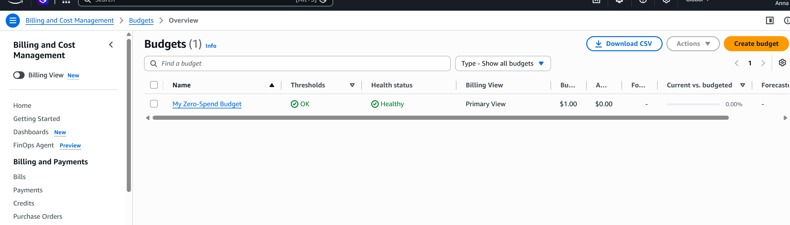
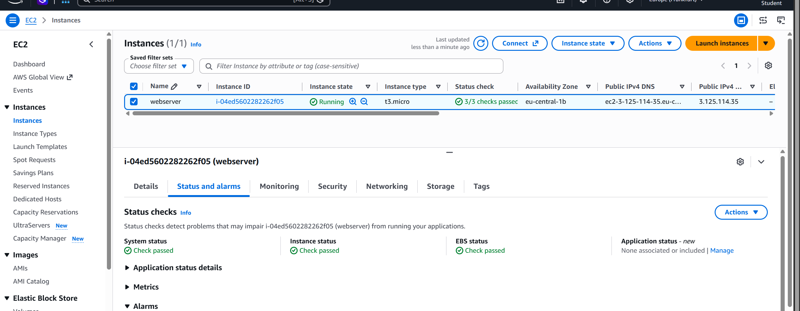
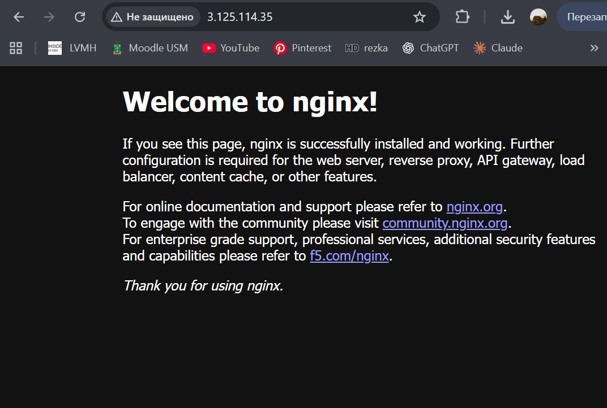
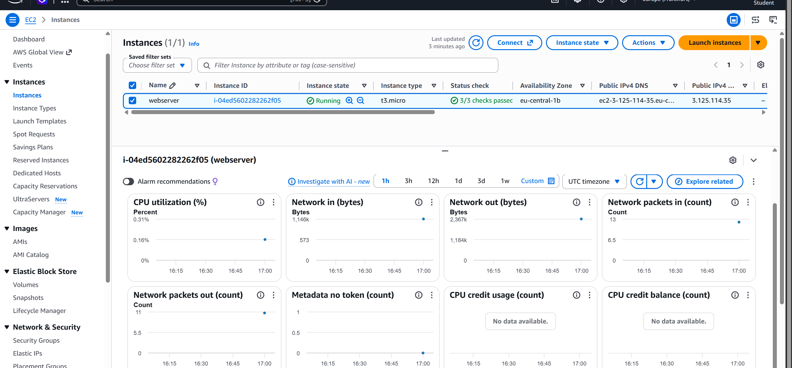
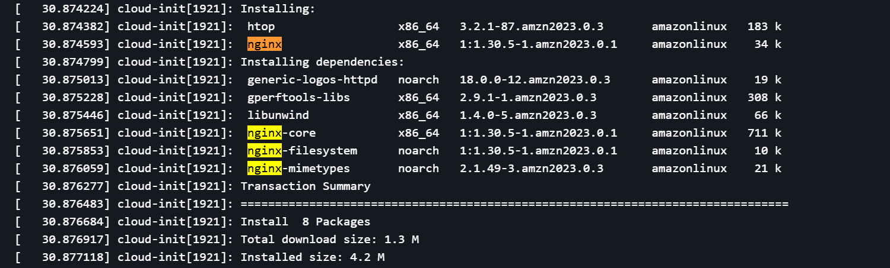
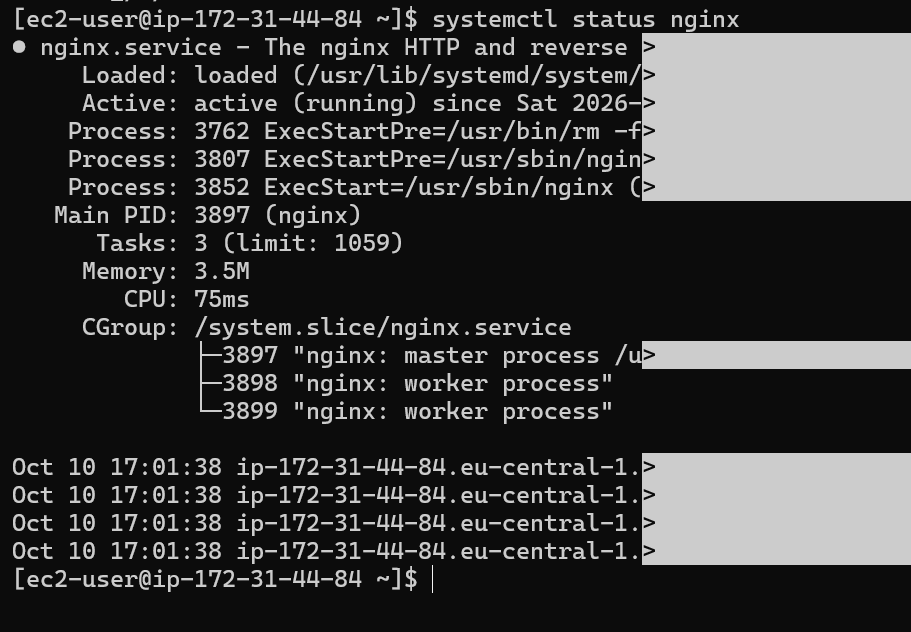
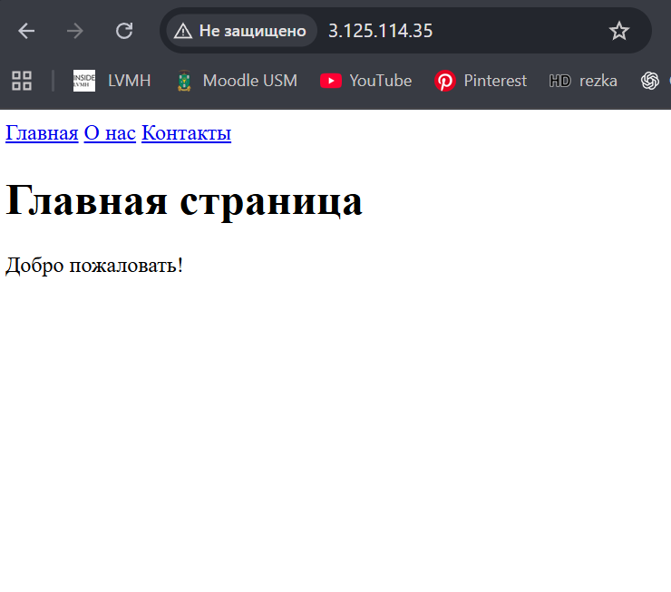
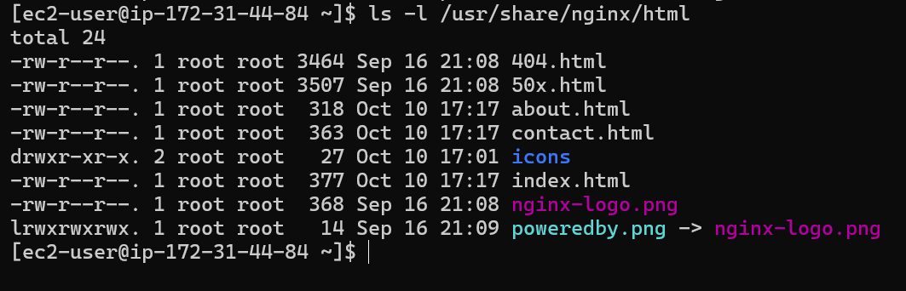
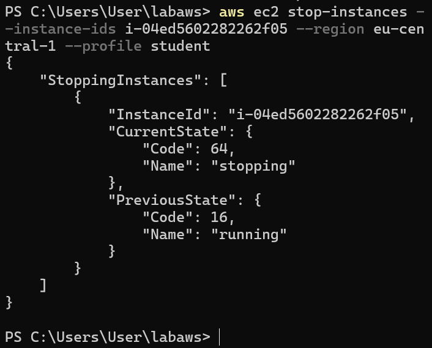

# Отчёт по лабораторной работе AWS

## 1. 
- ФИО: Кайнар Анна
- Группа: IA2403
- Выбранный уровень: Продвинутый

---

## 2. Задания базового уровня

Задание 1: бюджет ZeroSpend в списке Budgets.

Задание 2: экземпляр webserver в состоянии Running с пройденными проверками.

Задание 3: страница nginx в браузере по публичному IP.

Задание 4: вкладка Monitoring и фрагмент System log с установкой nginx.

Задание 5: успешное подключение по SSH и вывод systemctl status nginx.

Задание 6: ваш сайт в браузере и вывод ls -l /usr/share/nginx/html.

Задание 7: команда aws ec2 stop-instances и её вывод.

---

## 3. Задания продвинутого уровня
